# src コールグラフ

updated: `2026-04-21`

`src/` 配下の主要な呼び出し関係と Mermaid 図の見方をまとめます。

## 正本

- `docs/graphs/src/src_hierarchy.mmd`
- `docs/graphs/src/src_file_dependency.mmd`
- `docs/graphs/src/src_function_gui.mmd`
- `docs/graphs/src/src_function_packet.mmd`

## 生成図









## 更新手順

```powershell
python scripts/render_docs_graphs.py
```

Windows だけで運用する場合は `cli/render_src_call_graph.ps1` も使えます。

## 補足

- GUI 系の入口は `src/tenhou_hojo.py` と `src/app/main.py`
- packet 系の入口は `src/packet_capture.py` と `src/capture/*`
- 見え枚数系の正本は `src/visible_tiles.py`
- 自家の `2見え以下字牌` 一覧位置は `src/ui/table_renderer.py` の専用レイアウトロジックで決まる
