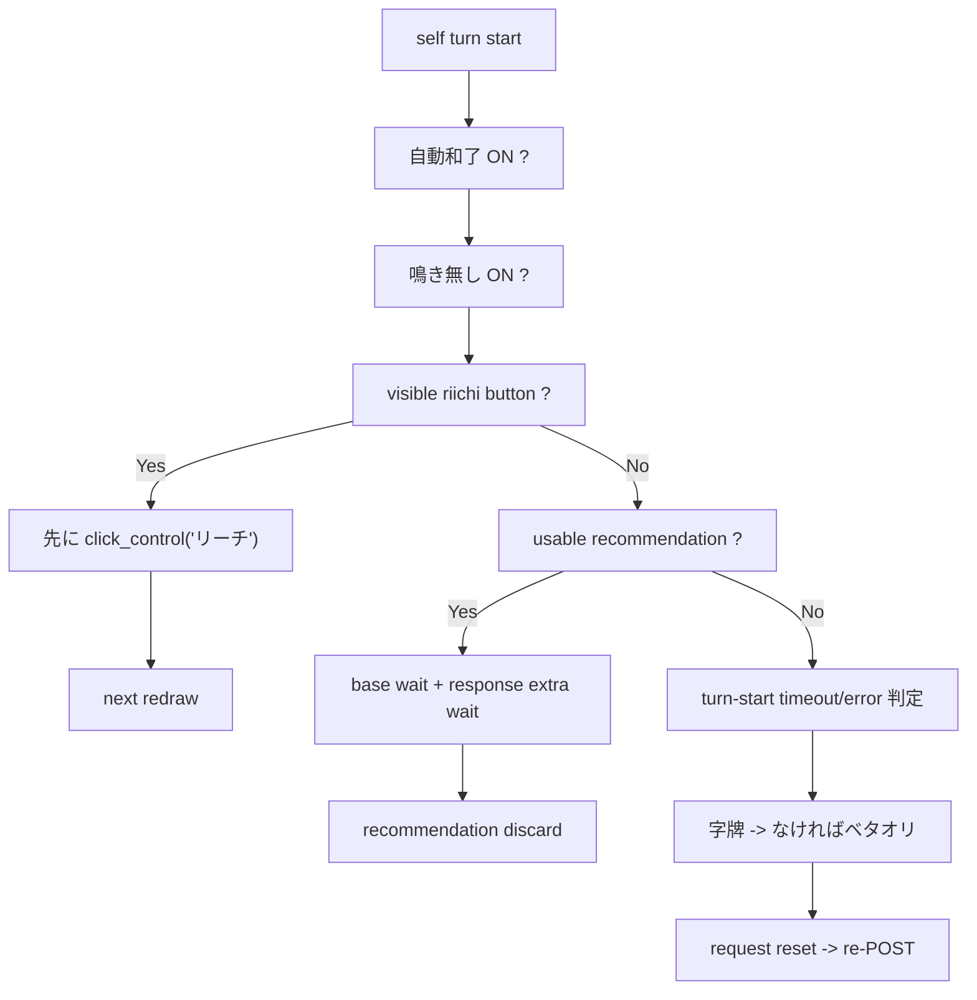

# pystyle 自動モード

updated: `2026-04-15`

## 1. 対象範囲

`pystyle ON` は次の 2 系統を持つ。

- `AI TOP3` 表示
- browser bridge 経由の自動打牌 / 自動リーチ / fallback / 再起動

## 2. 表示

- popup は最大 3 行
- 各候補は `pt + win%`
- 1 位は緑
- 2 位以下でも `top EV - 50pt` 以内なら緑

## 3. ターン進行

## 4. Guarantees

- `pystyle ON` 中は `自動和了` を先に ON へ揃える
- `pystyle ON` 中は `鳴き無し` を先に ON へ揃える
- 門前で visible `リーチ` が出たら recommendation より先に必ず押す
- bridge が `not ready -> ready` に戻った時は auto state を re-arm する
- `--p` で起動した時は初期状態を `pystyle ON` にする

## 5. Wait Rules

### recommendation がある時

- base wait を置く
- usable response が返っている時だけ、ツモ牌到着後の追加待機 `+0.9s`

### recommendation が無い時

- timeout 判定の基準は `request 開始時刻` ではなく `ツモ牌/鳴き後の打牌番開始時刻`
- no-response fallback は最大 `3.1s`

## 6. Timeout / Error Fallback

- no-response が続いたら `字牌 -> なければベタオリ`
- error 時も同じ fallback を使う
- fallback と同時に recommendation state を reset して re-POST する
- 挙動としては `pystyle OFF -> ON` 相当の再起動

## 7. Non-Goals

- fallback 中でも `pystyle` 表示を消さない
- popup の表示値は fallback と切り離して raw response を表示する

## 8. Related Files

- `src/app/hand_recommendation_service.py`
- `src/app/main.py`
- `src/ui/table_renderer.py`
