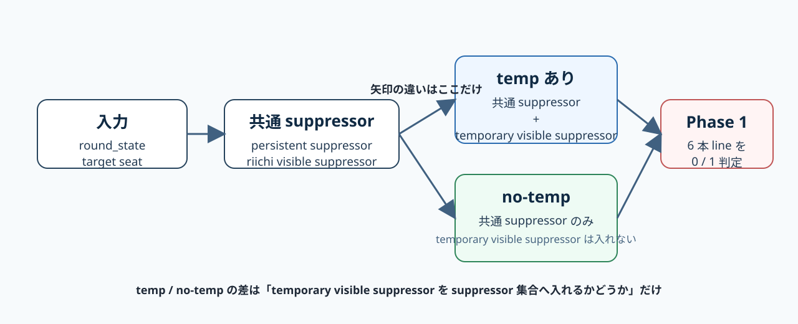
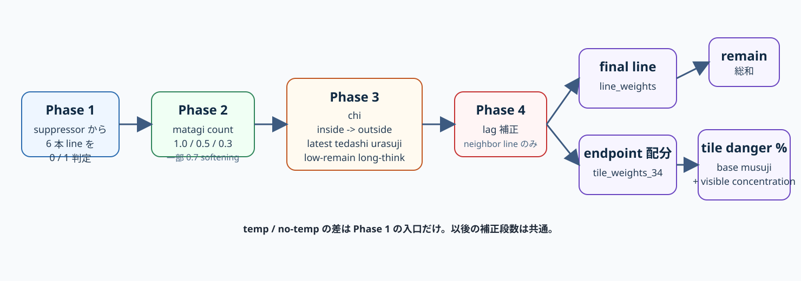
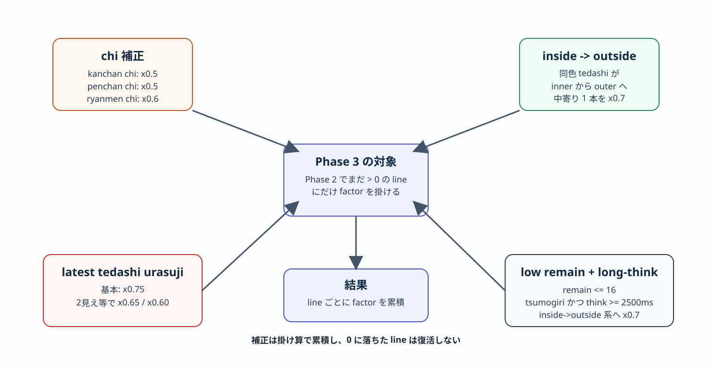
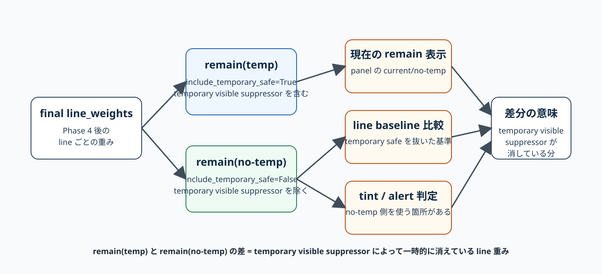

# suji temp / no-temp ロジック図解

この文書は `src/logic/danger_suji.py` のうち、`temp あり` と `no-temp` の差、筋本数カウント、補正、`remain` の意味を図で説明するためのものです。

対象関数:

- `src/logic/danger_suji.py::_build_weighted_suji_line_map`
- `src/logic/danger_suji.py::_line_suppressor_tile34_set`
- `src/logic/danger_suji.py::_temporary_safe_tile34_set`
- `src/logic/danger_suji.py::build_opponent_suji_danger_profile`

## 1. temp あり / no-temp の入口差

要点:

- 差が出るのは `temporary visible suppressor` を suppressor 集合へ入れるかどうか
- `persistent suppressor` は構造側の suppressor で、現行 no-temp 側では `called=False` の公開数牌 discard を基準に見る
- `temporary visible suppressor` は最新 non-riichi tedashi anchor 由来の一時 safe

## 2. 全体パイプライン

要点:

- Phase 1 で 6 本 line を `0 / 1` にする
- Phase 2 で `matagi` を数えて line ごとの基礎重みを作る
- Phase 3 で `chi / inside->outside / urasuji / low-remain-long-think` を掛ける
- Phase 4 で `lag` を近傍 line に足す
- 最後に `line_weights` の合計が `remain`

## 3. Phase 3 の補正

要点:

- `chi` は対象 line を `x0.5` または `x0.6`
- `inside -> outside` は中寄り 1 本を `x0.7`
- `latest tedashi urasuji` は `x0.75 / x0.65 / x0.60`
- `low remain + long-think tsumogiri` は特定条件で `inside->outside` と同系統の `x0.7`

## 4. remain(temp) / remain(no-temp) の意味

要点:

- `remain(temp)` は `include_temporary_safe=True`
- `remain(no-temp)` は `include_temporary_safe=False`
- 差は「temporary visible suppressor で一時的に消えている line」
- UI では `Remain: current/no-temp` として両方を出す

## 5. 用語

この文書で使う `tedashi` / `手出し` は、明示的な例外がない限り `鳴き手出し(post-call tedashi)` を含む。

| 用語 | 意味 |
| --- | --- |
| ツモ切り / `tsumogiri` | その巡目に引いた牌をそのまま切る打牌 |
| 手出し / `tedashi` | ツモ切りではない打牌全体。鳴き手出しを含む |
| 鳴き手出し / `post-call tedashi` | 鳴き直後に行う手出し。`tedashi` の部分集合 |
| persistent suppressor | 公開数牌 discard と `riichi_marker_before` discard から導く構造的 suppressor |
| temporary visible suppressor | 最新 non-riichi tedashi anchor から導く一時 safe suppressor |
| exact safe | line 終点の牌が完全安全になるもの |
| remain | `line_weights` の合計 |
| tile danger % | line weight を終点へ落とした後の危険度 |

## 6. 読み方

1. まず `temp/no-temp` の差は suppressor 集合だけだと見る
2. 次に `6本 line -> Phase 1 -> Phase 4` の順で重みが作られると見る
3. その合計が `remain`
4. endpoint へ落としたものが tile `%`
