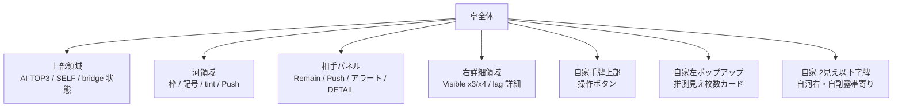

# 画面全体概要

updated: `2026-04-21`

この文書は、画面を「どこに何があるか」で把握するための入口です。

## レイアウト地図

## 領域要約

| 領域 | 主内容 | 詳細文書 |
| --- | --- | --- |
| 上部領域 | `AI TOP3`, `SELF`, bridge 状態, browser toggle | [alerts_and_panels.md](./alerts_and_panels.md), [controls_and_bridge.md](./controls_and_bridge.md) |
| 状況表 | `上家 / 対面 / 下家 / 総計` の 10 block 表 | [alerts_and_panels.md](./alerts_and_panels.md) |
| 河 | 枠、`L / Pl / P`、tint、Push | [river_display.md](./river_display.md) |
| 相手パネル | `Remain`, `Push`, alert, `DETAIL` | [alerts_and_panels.md](./alerts_and_panels.md) |
| 右詳細領域 | `Visible x3/x4`, lag 詳細 | [visible_counts_ui.md](./visible_counts_ui.md) |
| 自家字牌一覧 | `0見え / 1見え / 2見え` の字牌一覧 | [alerts_and_panels.md](./alerts_and_panels.md) |

## 通知

- `BG ... xN` は background worker の稼働数を示す
- 表示例の `5s` は直近の対象牌ラベル
- `xN` は開始回数ではなく「今動いている数」
