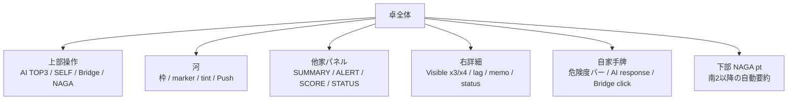

# 画面全体概要

updated: `2026-05-24`

## レイアウト地図

## 領域一覧

| 領域 | 内容 | 詳細 |
| --- | --- | --- |
| 上部操作 | `AI TOP3`, `SELF`, Bridge 状態, NAGA ボタン | [alerts_and_panels.md](./alerts_and_panels.md), [controls_and_bridge.md](./controls_and_bridge.md) |
| 河 | 捨て牌、枠、marker、tint、思考時間 band | [river_display.md](./river_display.md) |
| 他家パネル | `SUMMARY`, `ALERT`, `SCORE`, `DETAIL`, `STATUS` | [alerts_and_panels.md](./alerts_and_panels.md) |
| 右詳細 | Visible x3/x4、lag marker detail、memo、Nodocchi STATUS | [visible_counts_ui.md](./visible_counts_ui.md) |
| 自家手牌 | 手牌画像、危険度バー、自動/手動打牌 | [controls_and_bridge.md](./controls_and_bridge.md) |
| 下部 NAGA | 南2以降の段位 pt 自動要約 | [../integrations/naga_ptev_analyzer.md](../integrations/naga_ptev_analyzer.md) |

## 状態表示

- `BG ... xN` は background worker の稼働数を示す。
- `xN` は起動回数ではなく、その時点で動いている処理数。
- slow log は stdout と診断ログに出し、`side_panels` と `discards` の内訳を確認できる。

## 現行の注意点

- 河は差分描画なので、full redraw 時以外は `live_async_discards` 全体を削除しない。
- panel に出ない alert は音声対象にしない。
- NAGA 下部パネルは常時詳細を出す場所ではなく、局面上重要な pt 変化だけを短く出す。
